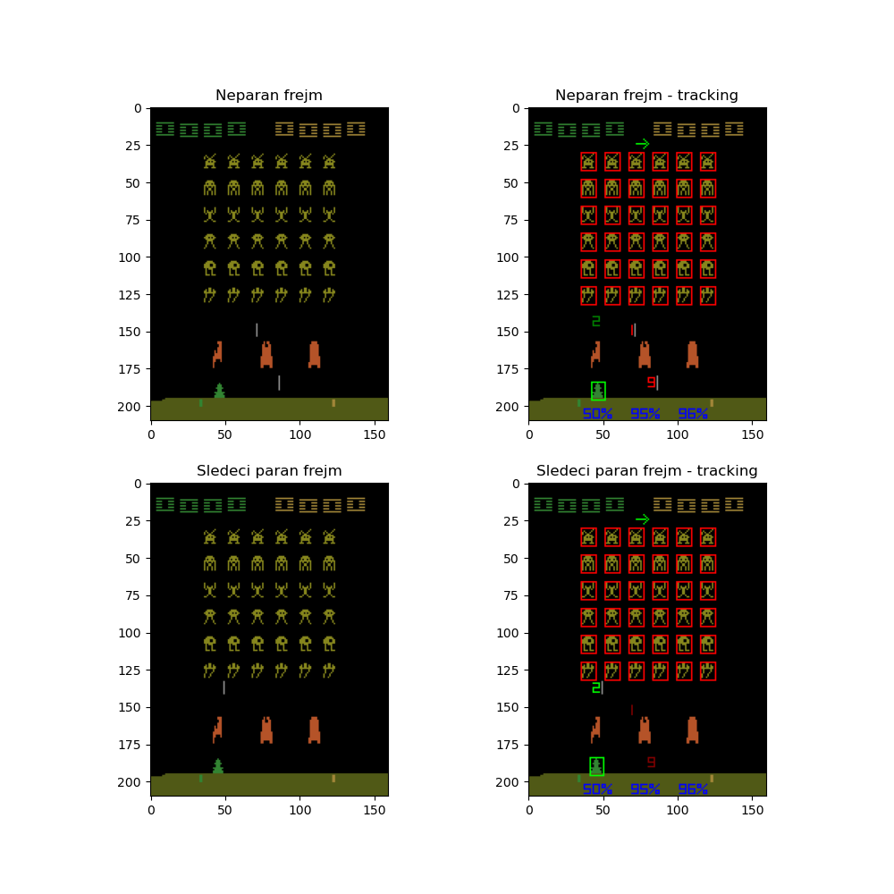

## Informacije o prepoznavanju objekata

Dimenzije frejma su **[210, 160]** u rgb formatu

Stanje koje vraća okruženje nakon izvršene akcije nije prvi sledeći frejm već vraća  2, 3 ili 4. naredni frejm prema uniformnoj raspodeli.

Prepoznaju se sve vrste vanzemaljaca, naš bot, rakete i barijere. Prati se kretanje raketa i vrši se predikcija njihovog položaja ukoliko se ne vide na trenutnom frejmu. Takođe se prati trenutno stanje barijera, odnosno stepen njihove oštećenosti. 

### Objekti čije je prepoznavanje implementirano

Sve vrste žutih vanzemaljaca sa svoja dva lica:

Takođe, implementirano je i prepoznavanje raketa ispaljenih kako od strane neprijateljskih vanzemaljaca, tako i od strane agenta.

Implementiran je i smer kretanja grupe žutih vanzemaljaca indikatorom u vidu strelice na levo i na desno.

### Pozicije i kretanje vanzemaljaca, raketa i agenta

- pozicija 1. barijere: **[157:175,42:50]**
- pozicija 2. barijere: **[157:175,74:82]**
- pozicija 3. barijere: **[157:175,106:114]**

- pozicija bota(agenta): **[185:195, x1:x2] **
	-** x2-x1 = 7** npr.** [185:195, 35:42]   **
	- **34<= x1 <=116** ;   **41<= x2 <=123**

- raketa (missile):   
	- raketa ispaljena od strane bota prelazi po 2 pixela po frejmu u proseku centar rakete,
	- vaznemaljska raketa  1 pixel po frejmu, 
	moze biti duzine između 6 i 12
	
Rakete koje agent ispaljuje se vide na parnim frejmovima, a rakete koje 
ispaljuju vanzemaljci na neparnim.

Žuti vanzemaljci:    rgb = **[134, 134,  29]** # zuti
- primer pozicije:    **[12:20, 10:17]**

Ljubicasti vanzemaljac:     pomera se za 1 pixel na 4 frejma
- primer pozicije: **[12:20, 13:20]**

